<picture>
  <source media="(prefers-color-scheme: dark)"  srcset="assets/banner-dark.svg">
  <source media="(prefers-color-scheme: light)" srcset="assets/banner-light.svg">
  
</picture>

 

 

&nbsp;&nbsp;
&nbsp;&nbsp;

  

---

## This is me :)

Hi, I'm **Nirmal**, a **technical team lead** in offensive security. I lead VAPT teams from scoping to sign-off: keeping people aligned, stakeholders informed and engagements delivered on time, while staying hands-on across web, API, mobile and network testing.

**Leadership**
- **People first**: leading, mentoring and unblocking security testing teams
- **Clear communication** with clients, stakeholders and development teams, from kickoff to final report
- **Timely delivery**: planning, prioritising and tracking engagements to committed deadlines
- **Remediation ownership**: turning findings into fixes alongside developers during audits

**Hands-on**
- Web & API security testing
- Mobile application penetration testing
- Network VAPT and vulnerability assessments
- On-site VAPT engagements

 

## certifications

<!-- SITE:CERTS:START -->

<!-- SITE:CERTS:END -->

---

## projects

<!-- SITE:PROJECTS:START -->
| Project | What it does | Stack |
| :--- | :--- | :--- |
| [**ReconCraft**](https://github.com/sneakywarwolf/ReconCraft) | Modular reconnaissance and vulnerability-scanning framework with a PyQt5 GUI. Plugin-based tool integration, parallel scanning, custom scan profiles, dashboards and an interactive CVSS v3.1 calculator. | `Python` `PyQt5` `Recon` `Linux` |
| [**PinSlayer**](https://github.com/sneakywarwolf/PinSlayer) | Frida-based SSL/TLS pinning bypass framework for Android. Hooks TrustManager, HostnameVerifier and related trust mechanisms at runtime to enable HTTPS interception without repackaging the APK. | `Frida` `Android` `Mobile Pentest` |
| [**SFAC**](https://github.com/sneakywarwolf/SFAC) | Subdomain Finder & Accessibility Checker. Enumerates subdomains via Sublist3r, checks which are live, captures headless screenshots and exports results to CSV. | `Python` `Recon` `Subdomains` |
<!-- SITE:PROJECTS:END -->

---

## writing

Latest from [sneakywarwolf.github.io](https://sneakywarwolf.github.io)

<!-- SITE:WRITING:START -->
| Post | Date | Topic |
| :--- | :---: | :--- |
| [How AI Is Changing Software Testing and VAPT](https://sneakywarwolf.github.io/posts/AI-Changing-Testing-Grounds/) | 2026-09-26 | Security / VAPT / AI |
| [The Environmental Consequences of the AI Boom](https://sneakywarwolf.github.io/posts/Environmental-Consequences-AI/) | 2026-09-20 | Technology / AI / Sustainability |
| [Token-Efficient AI- Headroom, Claude-Mem, and Context Engineering](https://sneakywarwolf.github.io/posts/Token-Efficient-Context-Engineering/) | 2026-09-19 | Technology / AI |
| [AI Skills, Plugins, and the Agent Stack- How the Right Combination Gets Work Done](https://sneakywarwolf.github.io/posts/AI-Skill-Plugins/) | 2026-09-18 | Technology / AI |
| [Task-Model-Tool Alignment: Choosing the Right AI Architecture](https://sneakywarwolf.github.io/posts/choosing-the-right-model-for-the-right-task/) | 2026-09-17 | AI / LLM / Engineering |
<!-- SITE:WRITING:END -->

---

`Let's make the digital world a safer place`

